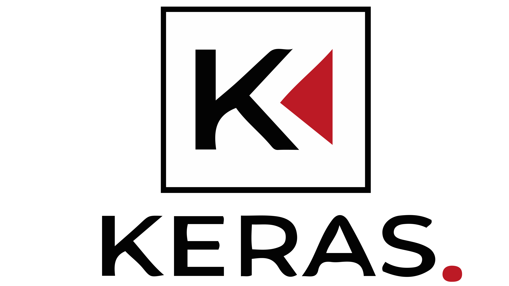

# KERAS — Automatic Commodity-Grade Classification of Apples and Carrots

<p align="center">
  
  &nbsp;&nbsp;&nbsp;&nbsp;
  
</p>

*A Study on Developing an Automatic Commodity-Grade Classification Algorithm for Apples and Carrots*

Science fair entry (Student Division) · 72nd Gangwon Special Self-Governing Province Science Fair (제72회 강원특별자치도과학전람회)

Team KERAS · Kangwon Science High School — Kim Da-hun, Lee Do-hyun, Jang Jae-hyun · Advisor: Hong Ye-rim

Repository: https://github.com/wkdwoguss/Keras_exhibition_project

---

## Overview

"Ugly produce" — fruits and vegetables that are nutritionally fine but fail cosmetic grading standards — is discarded in enormous quantities every year. The FAO estimates roughly 1.3 billion tons of food is wasted globally per year (about a third of total production), while a Korea Consumer Agency survey found that ~65% of consumers who had never bought "imperfect" produce would be willing to try it. The bottleneck is not consumer demand but the sorting process itself: commercial grading is still largely manual, labor-intensive, slow, and inconsistent between workers.

KERAS builds an **automatic, camera-based commodity-grade classifier** for two produce types — **apples** and **carrots** — that sorts each item into one of three classes, with a project target of **≥90% classification accuracy**:

| Class | Meaning |
|---|---|
| `Good` | Meets normal market appearance standards |
| `Imperfect` | Cosmetically flawed but edible/sellable as "ugly produce" |
| `Bad` | Not fit for consumption |

## How It Works

1. **Detect & track.** YOLOv8 with ByteTrack finds produce in the live camera feed. Apples use a YOLOv8 detector fine-tuned specifically on apples (weights not included in this repo — see [What's Actually in This Repository](#whats-actually-in-this-repository)); carrots reuse the stock `yolov8x.pt` COCO weights filtered to the built-in "carrot" class, since COCO already recognizes carrots well enough on its own.
2. **Filter.** Only objects fully inside the center 70% of the frame are considered. For apples specifically, a tracked object must also stay positionally stable for 5 consecutive frames and pass a Laplacian-variance sharpness check before it's classified, to avoid grading a blurry, still-moving item.
3. **Classify once per track.** The first time a track qualifies, its crop (padded 50px) has its background removed with `rembg` and is classified by a fine-tuned EfficientNetV2-S:
   - **Apple** — a single 3-class head → `Good` / `Imperfect` / `Bad`.
   - **Carrot** — a two-stage cascade: model 1 separates `Bad` vs. "not Bad"; only if it says "not Bad" does model 2 run, separating `Good` vs. `Imperfect`. This cascade exists because a single 3-class carrot model could never learn to recognize `Good` at all (see [`results.md`](results.md)).
4. **Report.** The result is cached per track ID, drawn as a color-coded bounding box (green = Good, orange = Imperfect, red = Bad) with an ID + label overlay, and printed to the terminal.

```
                     ┌──────────────────┐
   Camera frame ───► │ YOLOv8 + ByteTrack│  center-70% filter, (apple only)
                     │     detector       │  stability + blur filter
                     └────────┬─────────┘
                              │ crop (once per track ID)
                              ▼
                     ┌──────────────────┐
                     │ rembg background  │
                     │      removal      │
                     └────────┬─────────┘
                              ▼
                     ┌──────────────────┐
                     │ EfficientNetV2-S   │  apple: 3-class head
                     │   classifier       │  carrot: 2-stage cascade
                     └────────┬─────────┘
                              ▼
                     Color-coded bounding box +
                     label printed to terminal
```

> **Note — a classical, non-CNN "second algorithm" also exists and was deliberately *not* wired into the app.** `second_algo/algoapple.py` and `second_algo/algocarrot.py` grade produce using only mean HSV color distance (apples) or contour curvature (carrots), as a research question: could these cheap, classical signals reinforce or replace the CNN? Standalone, they scored only **64%** (apple, HSV) and **87%** (carrot, curvature) — both well below the CNN-only baselines below — so the report's conclusion, and this repo's actual behavior, is to classify with the EfficientNetV2-S model alone. `second_algo/` is kept as a documented negative result, not as a pipeline stage. Full discussion in [`results.md`](results.md#2-secondary-hsvcurvature-check-a-negative-result-not-used-in-the-app).

## What's Actually in This Repository

This repository holds the algorithm source code plus a small set of result figures used by `results.md`. It does **not** include the training dataset, the full report figure export, the written report, or any trained model weights — nothing is filtered out by a `.gitignore`; those files simply live on the authors' machines and were never committed.

```
.
├── LICENSE
├── README.md
├── results.md
├── main_apple.py           # Live apple grading: YOLO detect+track → rembg → EfficientNetV2-S
├── main_carrot.py          # Live carrot grading: YOLO detect+track → rembg → 2-stage EfficientNetV2-S
├── first_algo/
│   ├── apple_train.py      # Fine-tunes the apple EfficientNetV2-S classifier (Focal Loss, γ=1.7)
│   └── carrot_train.py     # Fine-tunes the two-stage carrot classifier (Focal Loss, γ=2.0)
├── second_algo/
│   ├── algoapple.py        # Research only — HSV-distance grading for apples (not used by main_apple.py)
│   └── algocarrot.py       # Research only — contour-curvature grading for carrots (not used by main_carrot.py)
└── docs/figures/            # Confusion matrices & loss curves referenced by results.md
```

To actually run `main_apple.py` / `main_carrot.py` you need to supply, outside of what's tracked here:
- a labeled dataset laid out as `Dataset/processed/{Train,Val}/{Apple_Train,Carrot_Train}/{Good,Imperfect,Bad}` (see [Dataset](#dataset)),
- a YOLOv8 apple detector fine-tuned on your own data, saved at `first_algo/apple_best.pt`,
- classifier checkpoints produced by the training scripts, placed at `first_algo/apple_weights.pth`, `first_algo/carrot_weights_1.pth`, and `first_algo/carrot_weights_2.pth` — `carrot_train.py` currently saves these as `stage1_best.pth` / `stage2_best.pth`, so copy/rename them into place before running `main_carrot.py`.

## Dataset

Training images came from public datasets (Harvard Dataverse's *Imperfect Apple* dataset, Kaggle, Roboflow), manually filtered to remove synthetic images, unrelated produce, and heavily obstructed shots, then cropped to individual objects and background-removed before training.

| Class | Carrot | Apple |
|---|---:|---:|
| Good | 776 | 644 |
| Imperfect | 837 | 178 |
| Bad | 660 | 1063 |

The apple dataset is heavily imbalanced (few `Imperfect` examples were publicly available), which is why fine-tuning uses **Alpha-balanced Focal Loss** instead of plain cross-entropy.

## Setup

```bash
pip install torch torchvision ultralytics opencv-python rembg onnxruntime scikit-learn matplotlib seaborn numpy
```

A CUDA-capable GPU is optional but recommended (`device = torch.device("cuda" if torch.cuda.is_available() else "cpu")` is used throughout).

## Usage

**Fine-tune a classifier** (point `train_dir` / `val_dir` at your own dataset first):
```bash
python first_algo/apple_train.py
python first_algo/carrot_train.py
```

**Run the live camera demo** (press `q` to quit) once the weights above are in place:
```bash
python main_apple.py
python main_carrot.py
```

**Try the research-only secondary check** (edit the hard-coded `goodpath` / `badpath` at the top of each script to point at a local folder of images first):
```bash
python second_algo/algoapple.py
```
(`second_algo/algocarrot.py` is a library of helper functions — `process`, `curvature`, `sortCarrot` — rather than a standalone script.)

## Method Summary

- **Detection** — YOLOv8 + ByteTrack. Apples use a detector fine-tuned specifically for apple surface defects; carrots use the stock COCO `yolov8x.pt` weights, since COCO's own "carrot" class is already sufficient.
- **Classification** — `torchvision.models.efficientnet_v2_s`, fine-tuned with Adam and **Alpha-balanced Focal Loss** to offset class imbalance (apple: γ = 1.7, single 3-class head; carrot: γ = 2.0, two-stage cascade — see [`results.md`](results.md) for why the cascade was necessary).
- **Secondary check (research, not deployed)** — mean HSV color-vector distance (apples) and discrete contour curvature (carrots), each thresholded against class-average ranges computed from the training set. Evaluated and found to *reduce* accuracy versus the CNN alone, so it is excluded from `main_apple.py` / `main_carrot.py`.

## Results

Headline numbers (full breakdown, confusion matrices, and discussion in [`results.md`](results.md)):

| Produce | Method actually used in the app | Accuracy |
|---|---|---:|
| Apple | EfficientNetV2-S only (γ = 1.7) | **94.83%** |
| Carrot | EfficientNetV2-S only, two-stage cascade (γ = 2.0) | **92.73%** |

| Produce | CNN + secondary check (research, *not* used in the app) | Accuracy |
|---|---|---:|
| Apple | EfficientNetV2-S + HSV-distance check | 64% |
| Carrot | EfficientNetV2-S + curvature check | 87% |

Both deployed models clear the ≥90% target set at the start of the project; adding the secondary check made both worse, which is why it isn't part of the shipped program.

## Future Work

- Validate the pipeline against real industrial sorting-line conditions (throughput, lighting variability, conveyor speed).
- Integrate with real automated sorting/conveyor hardware for a true smart-distribution pilot.
- Extend the same detect → remove-background → classify pipeline to other produce types beyond apples and carrots.

## References

1. FAO, *Global Food Losses and Food Waste*, Rome, 2011.
2. Korea Consumer Agency, "못난이 농산물 구매실태 및 인식," 2021.
3. Goodfellow, Bengio & Courville, *Deep Learning*, MIT Press, 2016.
4. MathWorks, "Convolutional neural network란?"
5. OpenCV Team, "Color spaces in OpenCV: HSV," 2025.
6. Lin, Goyal, Girshick, He & Dollár, "Focal Loss for Dense Object Detection," arXiv:1708.02022, 2017.
7. Applied Mathematics Division, Stellenbosch University, "Morphological Image Processing."
8. Sharma, Kumar & Musunuru, "The Good, the Bad and the Ugly: An Open Image Dataset for Automated Sorting of Good, Bad and Imperfect Produce Using AI and Robotics," *Sustainability*, 16(15), 6411, 2024.
9. Pacheco, González, Chuquimarca, Vintimilla & Velastin, "Fruit Defect Detection Using CNN Models with Real and Virtual Data," VISAPP, 2023.

## License

Copyright 2026 KERAS. All rights reserved — use of this work is not permitted without prior written permission (see [`LICENSE`](LICENSE)).

## Team

Team KERAS, Kangwon Science High School — Kim Da-hun · Lee Do-hyun · Jang Jae-hyun. Advisor: Hong Ye-rim.
Science fair entry, 72nd Gangwon Special Self-Governing Province Science Fair.
