# Results

## 1. CNN Fine-Tuning Results

### 1.1 Apple Grading Model

The apple classifier is a single EfficientNetV2-S with a 3-class head (`Good` / `Imperfect` / `Bad`), fine-tuned with Alpha-balanced Focal Loss. Two focusing-parameter values were tried:

| γ (gamma) | Result |
|---|---|
| 2.0 | Good overall separation, but more confusion between `Bad` and `Imperfect` |
| **1.7** | **Best result — final accuracy 94.83%** |

| γ=2.0 | γ=1.7 |
|---|---|
| 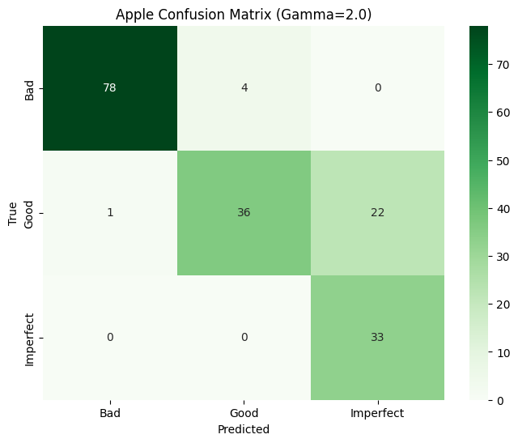 | 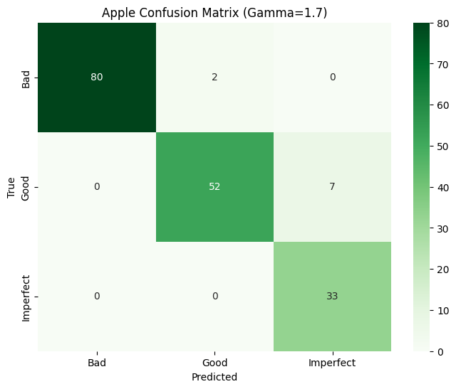 |

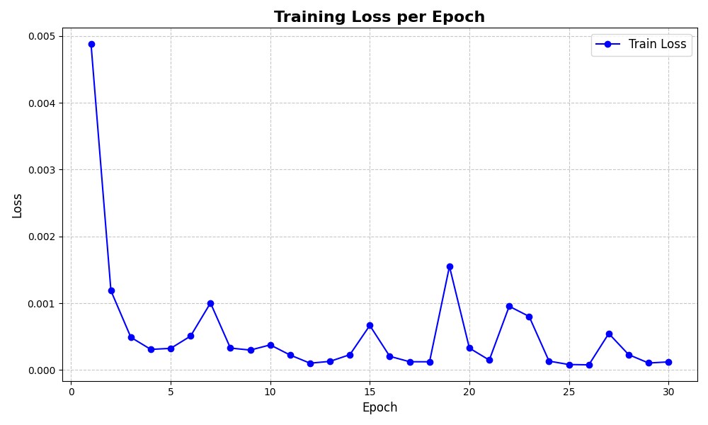
*Training-loss curve for the final apple model (30 epochs, lr=0.001, batch size=8).*

**γ = 1.7 was adopted as the final apple model**, reaching **94.83%** accuracy — comfortably above the ≥90% project target.

### 1.2 Carrot Grading Model — why a single model failed

The first attempt trained one 3-class EfficientNetV2-S directly on carrot images (epoch=50, lr=0.008, batch=64, γ=2.0). It completely failed to learn the `Good` class — **zero images were correctly predicted as `Good`**. Re-weighting Alpha-balanced Focal Loss to push `Good`'s loss contribution up (`Bad`/`Imperfect` α=0.2, `Good` α=0.6) and retraining did **not** fix it — `Good` recall stayed at 0%.

| First model (`Good` recall = 0%) | Reweighted retry (still 0%) |
|---|---|
| 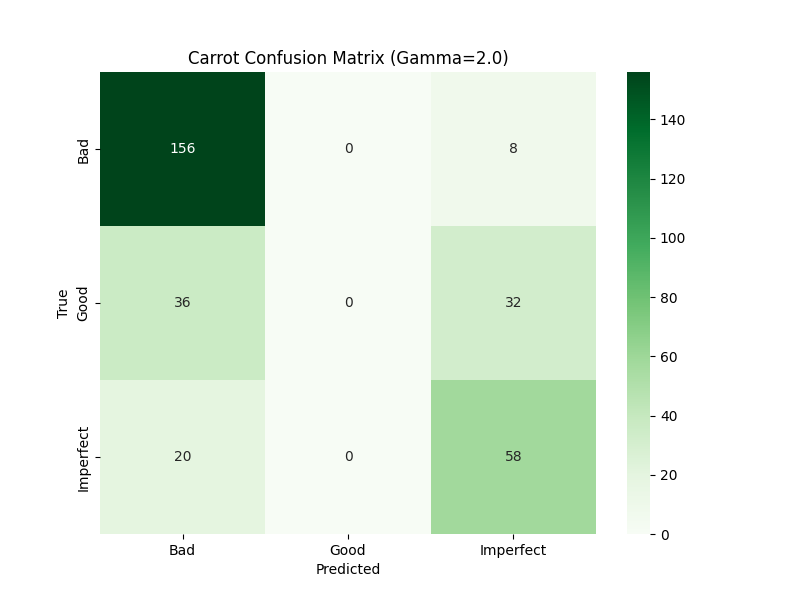 | 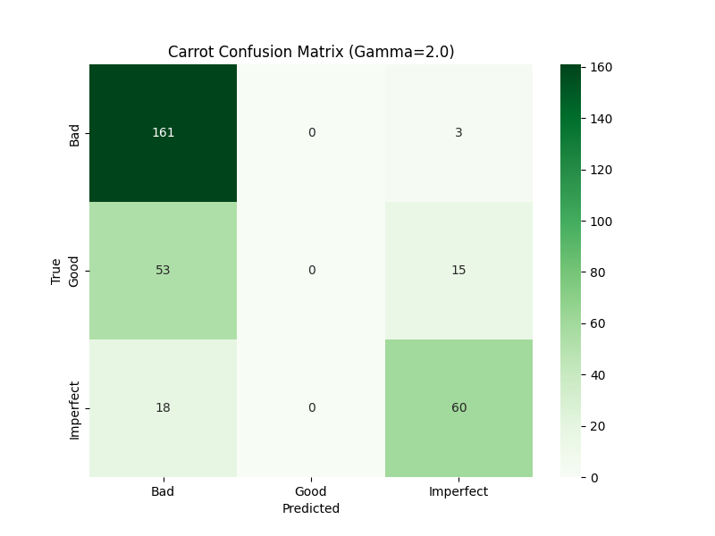 |

**Resolution: a two-stage cascade.**

| Stage | Task | Classes |
|---|---|---|
| Model 1 | Separate clearly unsellable produce first | `Bad` vs. `Not-Bad` (`Good` + `Imperfect` merged) |
| Model 2 | Only run if Model 1 says `Not-Bad` | `Good` vs. `Imperfect` |

With γ fixed at 2.0 for both stages, the combined two-stage model reached **92.73%** accuracy — well above target, and a fix for the single-model collapse on `Good`.

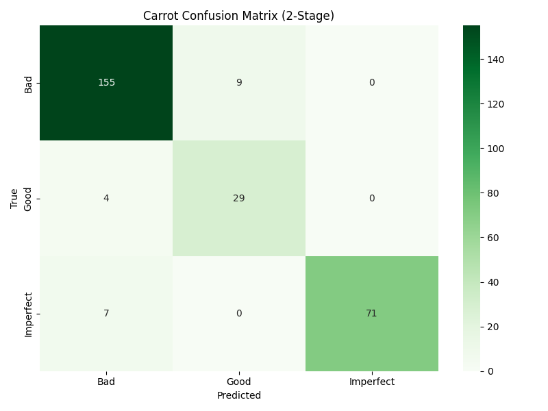

| Model 1 loss (Bad vs. Not-Bad) | Model 2 loss (Good vs. Imperfect) |
|---|---|
| 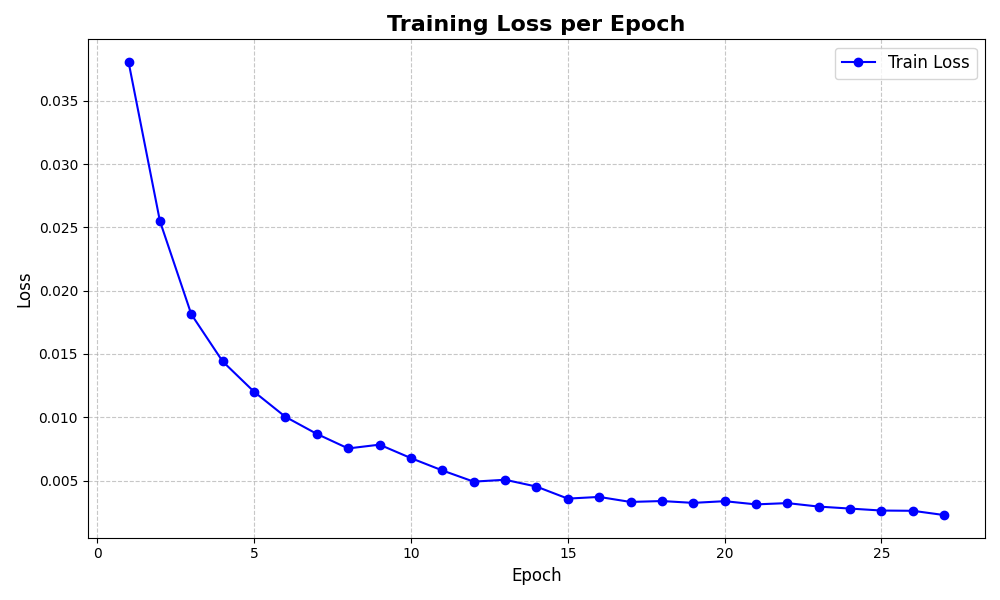 | 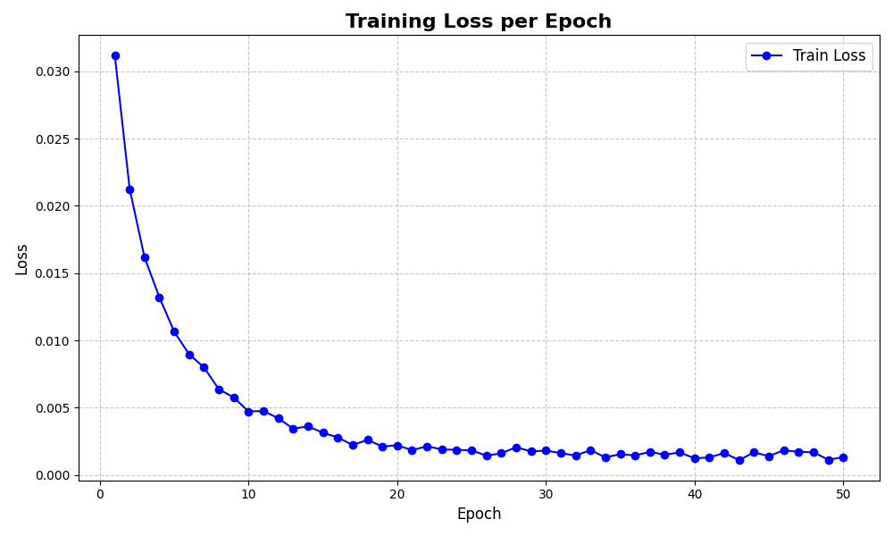 |

### 1.3 Summary

| Produce | Model | Accuracy |
|---|---|---:|
| Apple | EfficientNetV2-S, γ=1.7, single 3-class head | **94.83%** |
| Carrot | EfficientNetV2-S ×2, γ=2.0, two-stage cascade | **92.73%** |

Both results show the fine-tuning successfully learned the discriminating features of each class, and that the CNN approach is suitable for real-world commodity-grade classification.

## 2. Secondary HSV/Curvature Check — a Negative Result (Not Used in the App)

Alongside the CNN, a much cheaper, classical image-processing signal was tested as a way to reinforce (or stand in for) the CNN's prediction:

- **Apples** — the mean HSV pixel color of the (background-removed) produce, compared against the HSV ranges of `Good` and `Bad` training images.
- **Carrots** — the discrete curvature of the produce's contour, compared against the average curvature of `Good` and `Bad` training images.

**Computed reference ranges:**

| Class | Metric | Range / value |
|---|---|---|
| Apple, `Good` | HSV | H 14–29°, S 84–217, V 77–198 |
| Apple, `Bad` | HSV | H 17–37°, S 84–179, V 91–185 |
| Carrot, `Good` | mean contour curvature | ≈ 145.20 |
| Carrot, `Bad` | mean contour curvature | ≈ 100.78 |

| HSV distribution — `Bad` apples | HSV distribution — `Good` apples |
|---|---|
| 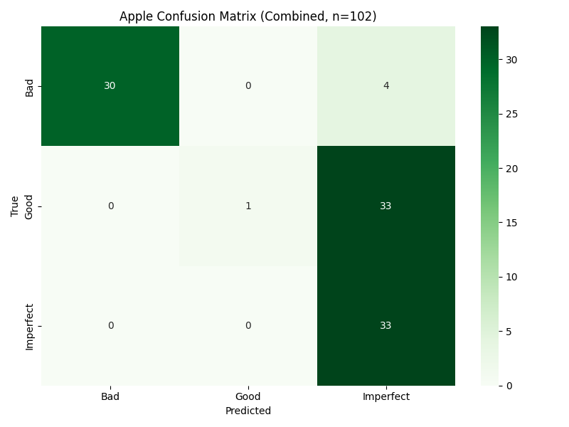 | 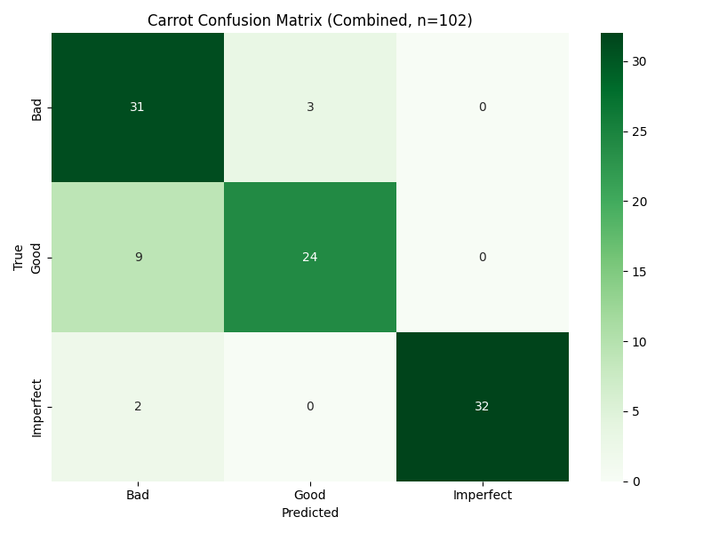 |

**Combination rule.** When the CNN and the secondary check disagreed, the *safer* (more conservative — never call something edible `Good` when either signal disagrees) label was returned: `Good`+`Imperfect` → `Imperfect`; `Bad`+`Imperfect` → `Bad`; `Good`+`Bad` → `Imperfect`.

**Result: accuracy went down, not up.**

| Produce | CNN alone | CNN + secondary check |
|---|---:|---:|
| Apple | 94.83% | **64%** |
| Carrot | 92.73% | **87%** |

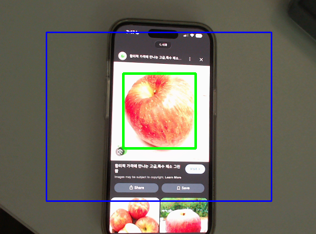
*Apple (left) and carrot (right) confusion matrices with the secondary check applied, n=102 each.*

**Interpretation.** Produce grade is driven by lighting, the object's 2-D pose/shape, and color placement in ways a single averaged color value or a 1-D contour-curvature statistic can't capture. A CNN that learns full 2-D spatial structure clearly outperforms simple pixel/shape averages for this task. Because of this, **the deployed program (`main_apple.py` / `main_carrot.py`) classifies using the EfficientNetV2-S model only** — the secondary check exists in `second_algo/` purely as a documented experiment, not as a pipeline stage.

## 3. Deployed Program

Given the result above, the final program was built **without** the secondary check. It:

- streams the connected camera, drawing the center 70% of the frame as a blue guide box,
- draws a bounding box around any tracked produce detected inside it, color-coded by predicted label (green/orange/red for Good/Imperfect/Bad),
- classifies each newly-tracked item once with the CNN and prints the grade to the terminal.

Separate programs (`main_apple.py`, `main_carrot.py`) were built per produce type, since the two use different detectors and different classifier architectures (single-head vs. two-stage).

## 4. Conclusion

| Question | Answer |
|---|---|
| Did fine-tuning EfficientNetV2-S work? | Yes — 94.83% (apple), 92.73% (carrot), both above the 90% target. |
| Did the single 3-class carrot model work? | No — it never learned `Good` at all, regardless of loss reweighting; fixed with a two-stage cascade. |
| Did adding an HSV/curvature secondary check help? | No — accuracy dropped to 64% (apple) and 87% (carrot); it was dropped from the deployed app. |
| Is the system ready for real deployment? | This is an initial validation of feasibility, not a production system — see [`README.md`](README.md#future-work) for what's needed next. |

## 5. Reproducing These Numbers

The code that produced these results:
- `first_algo/apple_train.py` — apple fine-tuning + evaluation (produces the γ comparison and loss curve above).
- `first_algo/carrot_train.py` — two-stage carrot fine-tuning + evaluation (produces the cascade confusion matrix and loss curves above).
- `second_algo/algoapple.py`, `second_algo/algocarrot.py` — the HSV/curvature secondary check and its standalone accuracy evaluation (produces the 64%/87% numbers above).

All three scripts are published in the [GitHub repository](https://github.com/wkdwoguss/Keras_exhibition_project); the training dataset and trained weights needed to actually reproduce the numbers are not (see [`README.md`](README.md#whats-actually-in-this-repository)).
